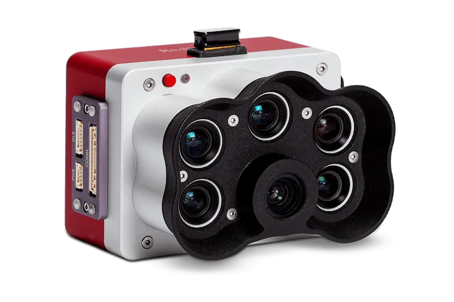

# PIMP: Procesamiento de Imágenes Multiespectrales en Python 📊💻🐍


## Descripción

La clase `PIMP` es una herramienta en Python diseñada para el procesamiento y análisis de datos de imágenes multiespectrales, especialmente imágenes capturadas con cámaras [RedEdge-P](https://www.micasense.com/rededge-p). Proporciona funcionalidades para cargar, alinear, componer y analizar imágenes, así como para realizar preprocesamiento de datos.



## Características

- Carga de imágenes y sus bandas correspondientes (BLUE, RED, GREEN, NIR).
- Alineación de las bandas de imágenes multiespectrales.
- Generación de composiciones RGB.
- Cálculo del Índice de Vegetación de Diferencia Normalizada (NDVI).
- Visualización de imágenes, histogramas y boxplots.
- Recorte de imágenes.
- Filtrado de píxeles basado en umbral y cálculo de estadísticas adicionales.
- Generación de matrices de correlación entre variables.

## Uso Básico

```python
# Importar la clase PIMP
from pimp import PIMP

# Crear una instancia de la clase PIMP con la lista de rutas de las imágenes
pimp = PIMP(lista_rutas=["/ruta/imagen_1_", "/ruta/imagen_2_"])

# Cargar las bandas de las imágenes
pimp.leer_bandas()

# Alinear las bandas de las imágenes
pimp.alineacion_canales()

# Generar composiciones RGB
pimp.composicion_rgb(tipo='alineada')

# Calcular el NDVI de las imágenes alineadas
ndvi_resultados = pimp.calcular_ndvi_imagenes()

# Graficar las imágenes, histogramas, boxplots y parcelas
pimp.graficar_imagenes(num_filas=2, num_columnas=2, titulos=['Imagen 1', 'Imagen 2', 'NDVI 1', 'NDVI 2'], tipo='alineada')
pimp.graficar_histobox_ndvi(titulos=['NDVI 1', 'NDVI 2'])
parcelas = pimp.recortar_imagen(indice_imagen=0, coordenadas_recorte=[(100, 100, 200, 200)])
pimp.grafica_parcelas(parcelas, titulos=['Parcela 1'])
